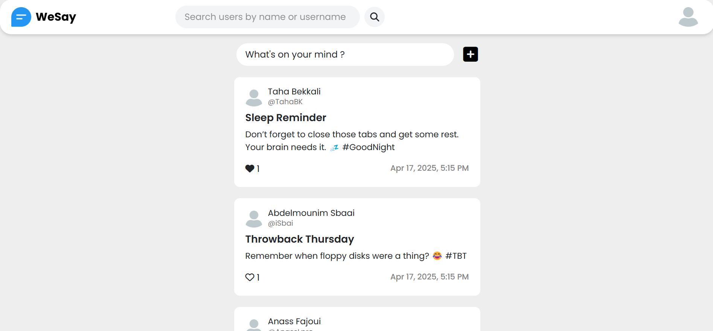
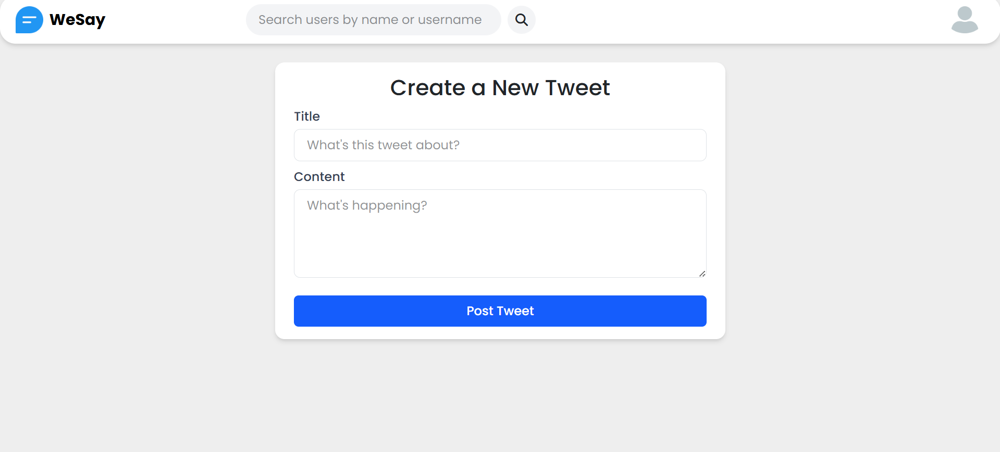
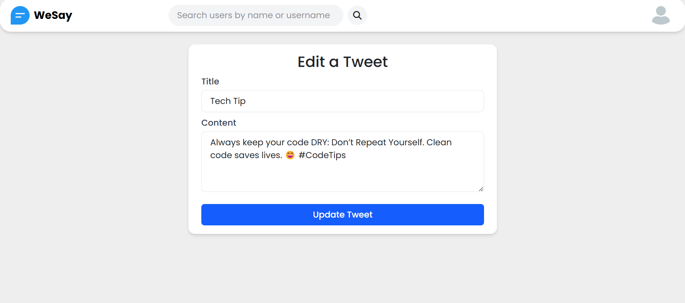
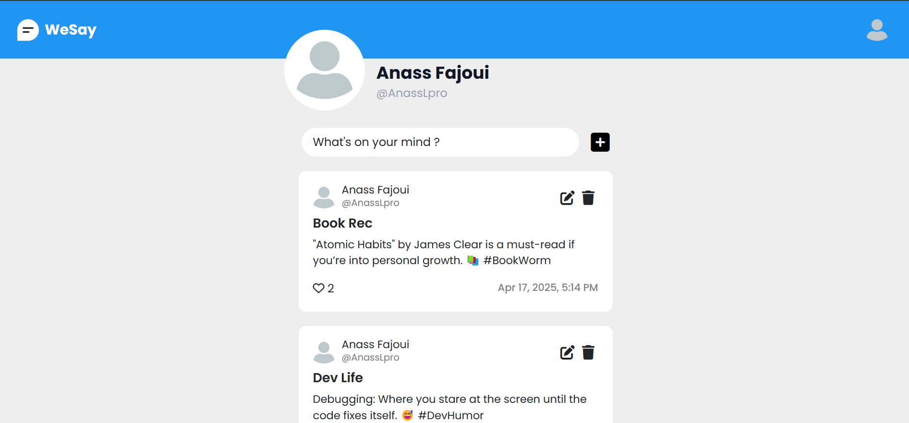
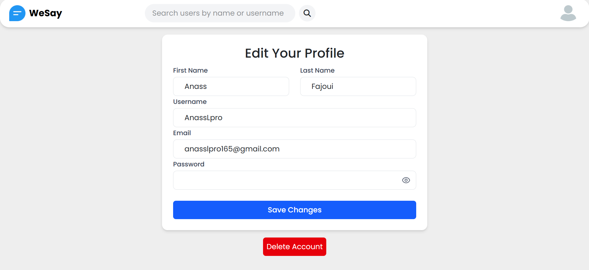
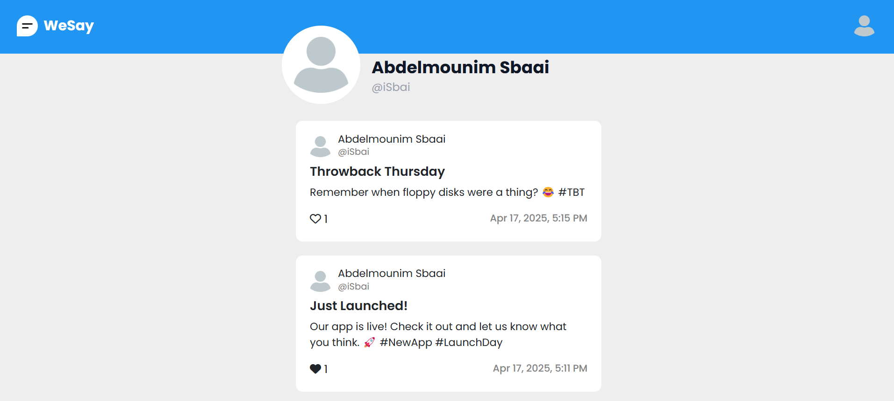

[The Back end Repository](https://github.com/Anass-Fajoui/WeSay-Back-end)
# WeSay 🐦

A simple Twitter clone web application built with Spring Boot and a modern frontend stack.  
WeSay allows users to share short posts (tweets), like them, browse other users’ profiles, and manage their accounts.

---

## 🚀 Features

- 🔐 User Authentication (Register / Login / Logout)
- 📝 Create, update, and delete tweets
- 🧵 View all tweets in a shared public feed
- ❤️ Like tweets
- 🔍 Search for users
- 👤 View other users' profiles with their tweet history
- ⚙️ Edit or delete your own account

---

## 🖼️ Screenshots

### 🔐 Authentication Pages

  
  

### 🏠 Feed Page

  

### 📝 Tweet Creation / Edit

  
  

### 👤 My Profile

  

### 👤 Edit My Profile Info

  

### 👤 Other User Profile

  

---

## 🛠️ Tech Stack

**Frontend**  
- HTML, CSS  
- Tailwind CSS  
- TypeScript  
- React (optional if used)

**Backend**  
- Java  
- Spring Boot  
- RESTful API
